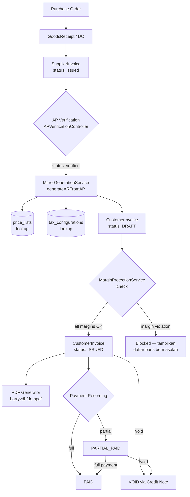
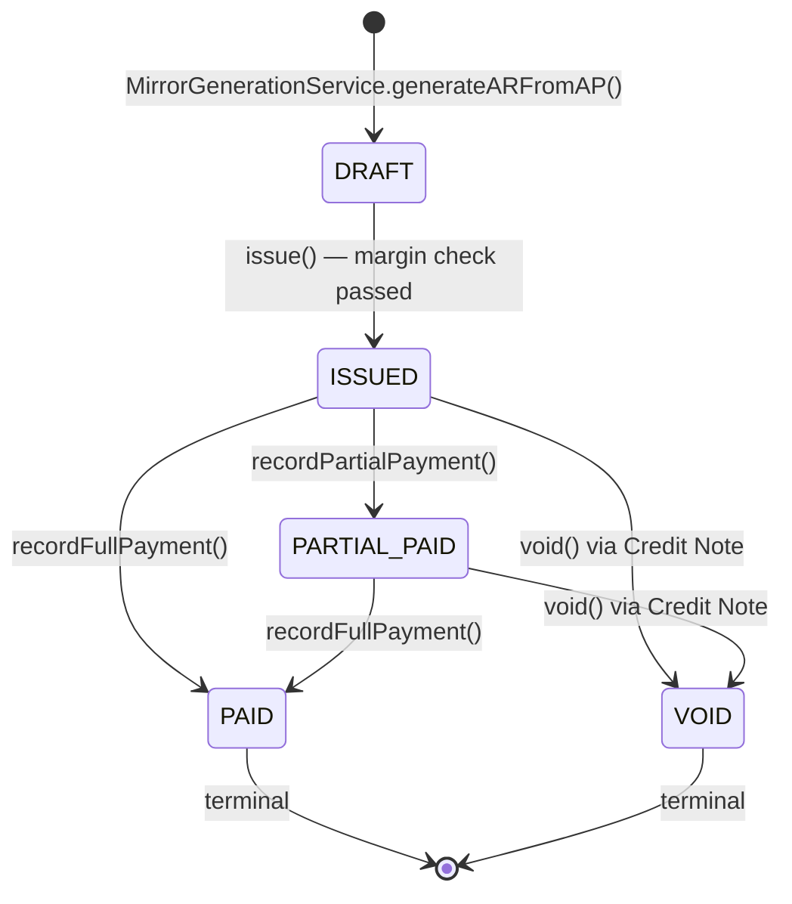

# Design Document — AR Invoice System

## Overview

AR Invoice System adalah modul Accounts Receivable untuk Medikindo, distributor farmasi B2B yang beroperasi dengan model **dropship/back-to-back order**. Karena Medikindo belum memiliki gudang fisik, distributor langsung mengirim ke RS/Klinik, sehingga Supplier Invoice (AP) menjadi *single source of truth* untuk pergerakan fisik barang.

Arsitektur inti mengikuti **"The Mirror Model"**: setiap SupplierInvoice yang diverifikasi secara otomatis "dipantulkan" menjadi draft CustomerInvoice menggunakan harga jual dari Master Price List. Finance staff hanya perlu mereview dan menerbitkan — tanpa re-entry data.

Alur utama:
```
PO → GR/DO → SupplierInvoice (AP verified) → [MirrorGenerationService] → CustomerInvoice (AR draft) → Review → ISSUED
```

### Tujuan Utama

- Eliminasi phantom billing melalui Anti-Phantom Link (`supplier_invoice_id` wajib)
- Audit trail BPOM/Kemenkes melalui Mirror Link (`supplier_invoice_item_id` + batch/expiry copy)
- Kalkulasi mixed-tax per baris dengan floor rounding
- PDF invoice standar farmasi dengan e-Meterai, barcode, dan tanda tangan
- AR Aging Dashboard untuk monitoring piutang

---

## Architecture

### The Mirror Model — Alur Lengkap



### State Machine CustomerInvoice



### Komponen Utama

```
┌─────────────────────────────────────────────────────────────────┐
│                        HTTP Layer                               │
│  APVerificationController  CustomerInvoiceController            │
│  PriceListController       ARAgingController                    │
└──────────────────────────┬──────────────────────────────────────┘
                           │
┌──────────────────────────▼──────────────────────────────────────┐
│                      Service Layer                              │
│  MirrorGenerationService    InvoiceCalculationService           │
│  MarginProtectionService    ImmutabilityGuardService            │
│  TerbilangService           TaxCalculatorService                │
│  BCMathCalculatorService    AuditService                        │
└──────────────────────────┬──────────────────────────────────────┘
                           │
┌──────────────────────────▼──────────────────────────────────────┐
│                       Data Layer                                │
│  CustomerInvoice            CustomerInvoiceLineItem             │
│  SupplierInvoice            SupplierInvoiceLineItem             │
│  PriceList                  TaxConfiguration                    │
│  Organization               GoodsReceipt                       │
└─────────────────────────────────────────────────────────────────┘
```

---

## Components and Interfaces

### Service: MirrorGenerationService (Baru)

Jantung sistem — mengotomatisasi pembuatan draft AR dari AP yang sudah diverifikasi.

```php
class MirrorGenerationService
{
    public function generateARFromAP(
        SupplierInvoice $apInvoice,
        int $customerId
    ): CustomerInvoice;

    // Cek apakah draft AR sudah ada untuk supplier_invoice_id ini
    public function draftExists(int $supplierInvoiceId): bool;
}
```

**Algoritma generateARFromAP:**
1. Guard: cek `draftExists()` — jika sudah ada, log warning dan return existing
2. Guard: validasi `apInvoice->status` harus `verified` atau `paid`
3. Buka DB transaction
4. Buat header `CustomerInvoice` dengan status `DRAFT`, set `supplier_invoice_id`
5. Loop setiap `SupplierInvoiceLineItem`:
   a. Lookup harga jual dari `PriceListService::lookup(org_id, product_id)`
   b. Throw `PriceListNotFoundException` jika tidak ada harga
   c. Hitung tax dengan floor rounding via `InvoiceCalculationService`
   d. Copy `batch_number`, `expiry_date`, `quantity`, `uom` identik dari AP
   e. Simpan `supplier_invoice_item_id` (Mirror Link) dan `cost_price` (dari AP)
6. Hitung grand total via `InvoiceCalculationService::calculateGrandTotal()`
7. Auto e-Meterai jika >= threshold dari `TaxConfiguration`
8. Commit transaction
9. Dispatch `NewInvoiceNotification` ke finance staff

### Service: InvoiceCalculationService (Upgrade)

Upgrade dari implementasi existing untuk mendukung:
- Mixed-tax per baris (bukan satu rate untuk semua)
- Floor rounding per baris (bukan round/ceil)
- Baca PPN rate dari `TaxConfiguration` (tidak hardcode)
- Baca e-Meterai threshold dari `TaxConfiguration`
- Hitung grand total: `subtotal - discount + tax + surcharge + ematerai_fee`

```php
class InvoiceCalculationService
{
    // Existing methods dipertahankan, tambah:
    public function calculateTaxFloor(string $dpp, string $rate): string;
    public function calculateGrandTotal(array $lineItems, string $surcharge): array;
    public function getActivePPNRate(): string;       // dari TaxConfiguration
    public function getEMeteraiThreshold(): string;   // dari TaxConfiguration
}
```

### Service: MarginProtectionService (Baru)

```php
class MarginProtectionService
{
    // Returns array of violations: [['product_name', 'selling_price', 'cost_price', 'diff'], ...]
    public function check(CustomerInvoice $invoice): array;

    // Cek apakah user punya permission override_margin_protection
    public function canOverride(User $user): bool;

    // Log override ke audit_logs
    public function logOverride(CustomerInvoice $invoice, User $user, string $reason): void;
}
```

### Service: TerbilangService (Baru)

```php
class TerbilangService
{
    // Convert angka ke teks Bahasa Indonesia
    // Contoh: 1500000 → "Satu Juta Lima Ratus Ribu Rupiah"
    public function convert(int|float $amount): string;

    // Handle hingga 999.999.999.999 (ratusan miliar)
    // Handle desimal: "... Rupiah Lima Puluh Sen"
    // Handle negatif: "Minus ..."
}
```

### Service: PriceListService (Baru)

```php
class PriceListService
{
    // Lookup harga jual: customer-specific → fallback ke products.selling_price
    // Prioritas: is_active=true, effective_date <= today, expiry_date IS NULL OR >= today
    // Order by effective_date DESC, ambil pertama
    public function lookup(int $organizationId, int $productId): string;
}
```

### Controller: APVerificationController (Baru)

```php
class APVerificationController extends Controller
{
    public function verify(
        Request $request,
        SupplierInvoice $invoice,
        MirrorGenerationService $mirror
    ): RedirectResponse;
}
```

### Controller: CustomerInvoiceController (Upgrade)

```php
class CustomerInvoiceController extends Controller
{
    public function index(Request $request): View;
    public function show(CustomerInvoice $invoice): View;
    public function issue(CustomerInvoice $invoice, MarginProtectionService $margin): RedirectResponse;
    public function void(Request $request, CustomerInvoice $invoice): RedirectResponse;
    public function print(CustomerInvoice $invoice): Response; // PDF + increment print_count
}
```

### Controller: ARAgingController (Baru)

```php
class ARAgingController extends Controller
{
    public function index(Request $request): View;
    // Klasifikasi: 0-30 (current/hijau), 31-60 (warning/kuning), >60 (overdue/merah)
    // Exclude status PAID dan VOID
}
```

### Controller: PriceListController (Baru)

Resource controller standar Laravel untuk CRUD `price_lists`.

---

## Data Models

### Tabel Baru: `price_lists`

```php
Schema::create('price_lists', function (Blueprint $table) {
    $table->id();
    $table->foreignId('organization_id')->constrained('organizations');
    $table->foreignId('product_id')->constrained();
    $table->decimal('selling_price', 15, 2);
    $table->date('effective_date');
    $table->date('expiry_date')->nullable();
    $table->boolean('is_active')->default(true);
    $table->timestamps();
    $table->unique(['organization_id', 'product_id', 'effective_date']);
});
```

### Tabel Baru: `tax_configurations`

```php
Schema::create('tax_configurations', function (Blueprint $table) {
    $table->id();
    $table->string('name', 100);
    $table->decimal('rate', 5, 2);
    $table->boolean('is_default')->default(false);
    $table->date('effective_date');
    $table->text('description')->nullable();
    $table->timestamps();
});
```

**Seed data:**
- `{name: "PPN Standard", rate: 11.00, is_default: true, effective_date: "2022-04-01"}`
- `{name: "PPN 12%", rate: 12.00, is_default: false, effective_date: "2025-01-01"}`
- `{name: "EMeterai_Threshold", rate: 5000000.00, is_default: false, effective_date: "2021-10-01"}`

### Upgrade: `organizations`

Tambah kolom:
- `npwp` VARCHAR(20) nullable
- `nik` VARCHAR(16) nullable
- `customer_code` VARCHAR(50) nullable unique
- `bank_accounts` JSON nullable

### Upgrade: `goods_receipts`

Tambah kolom:
- `do_number` VARCHAR(50) nullable unique
- `delivered_at` TIMESTAMP nullable

### Upgrade: `customer_invoices`

Tambah/ubah kolom:
- `supplier_invoice_id` BIGINT UNSIGNED FK nullable → `supplier_invoices` (**Anti-Phantom Link**)
- `status` ENUM: `draft`, `issued`, `partial_paid`, `paid`, `void` (replace existing)
- `surcharge` DECIMAL(15,2) default 0
- `ematerai_fee` DECIMAL(15,2) default 0
- `payment_term` VARCHAR(100) nullable
- `salesman` VARCHAR(100) nullable
- `tax_number` VARCHAR(50) nullable
- `barcode_serial` VARCHAR(100) nullable unique
- `print_count` INTEGER default 0
- `last_printed_at` TIMESTAMP nullable
- Semua monetary columns: DECIMAL(15,2)

### Upgrade: `customer_invoice_line_items`

Tambah kolom:
- `supplier_invoice_item_id` BIGINT UNSIGNED FK NOT NULL → `supplier_invoice_items` (**Mirror Link**)
- `cost_price` DECIMAL(15,2) — snapshot harga beli dari AP
- `batch_number` VARCHAR(50) nullable (NOT NULL untuk narkotika/psikotropika)
- `expiry_date` DATE nullable (NOT NULL untuk narkotika/psikotropika)
- `uom` VARCHAR(20) nullable
- `tax_rate` DECIMAL(5,2) default 0
- `tax_amount` DECIMAL(15,2) default 0

### Model: PriceList (Baru)

```php
class PriceList extends Model
{
    public function organization(): BelongsTo { ... }
    public function product(): BelongsTo { ... }

    // Scope: active price lists valid for today
    public function scopeActiveForDate($query, Carbon $date): Builder { ... }
}
```

### Model: TaxConfiguration (Baru)

```php
class TaxConfiguration extends Model
{
    // Get active default PPN rate
    public static function getActivePPNRate(): string { ... }

    // Get e-Meterai threshold
    public static function getEMeteraiThreshold(): string { ... }
}
```

### Model: CustomerInvoice (Upgrade)

```php
class CustomerInvoice extends Model
{
    // Status constants baru
    public const STATUS_DRAFT        = 'draft';
    public const STATUS_ISSUED       = 'issued';
    public const STATUS_PARTIAL_PAID = 'partial_paid';
    public const STATUS_PAID         = 'paid';
    public const STATUS_VOID         = 'void';

    public const TRANSITIONS = [
        self::STATUS_DRAFT        => [self::STATUS_ISSUED],
        self::STATUS_ISSUED       => [self::STATUS_PARTIAL_PAID, self::STATUS_PAID, self::STATUS_VOID],
        self::STATUS_PARTIAL_PAID => [self::STATUS_PAID, self::STATUS_VOID],
        self::STATUS_PAID         => [], // terminal
        self::STATUS_VOID         => [], // terminal
    ];

    // Relasi baru
    public function supplierInvoice(): BelongsTo { ... }
    public function lineItems(): HasMany { ... }
}
```

### Model: CustomerInvoiceLineItem (Upgrade)

```php
class CustomerInvoiceLineItem extends Model
{
    // Relasi baru: Mirror Link ke AP line item
    public function supplierItem(): BelongsTo
    {
        return $this->belongsTo(SupplierInvoiceLineItem::class, 'supplier_invoice_item_id');
    }
}
```

### Routes

```php
// AR Invoice
Route::get('/invoices/customer', [CustomerInvoiceController::class, 'index'])
    ->name('web.invoices.customer.index');
Route::get('/invoices/customer/{invoice}', [CustomerInvoiceController::class, 'show'])
    ->name('web.invoices.customer.show');
Route::post('/invoices/customer/{invoice}/issue', [CustomerInvoiceController::class, 'issue'])
    ->name('web.invoices.customer.issue');
Route::post('/invoices/customer/{invoice}/void', [CustomerInvoiceController::class, 'void'])
    ->name('web.invoices.customer.void');
Route::get('/invoices/customer/{invoice}/pdf', [CustomerInvoiceController::class, 'print'])
    ->name('web.invoices.customer.pdf');

// AP Verification (trigger Mirror)
Route::post('/invoices/supplier/{invoice}/verify', [APVerificationController::class, 'verify'])
    ->name('web.invoices.supplier.verify');

// Price List Management
Route::resource('/price-lists', PriceListController::class)
    ->names('web.price-lists');

// AR Aging Dashboard
Route::get('/ar-aging', [ARAgingController::class, 'index'])
    ->name('web.ar-aging.index');
```

### PDF Template Structure

File: `resources/views/pdf/customer_invoice.blade.php` (A4, portrait, via barryvdh/laravel-dompdf)

```
┌─────────────────────────────────────────────────────────┐
│ [LOGO] MEDIKINDO          INVOICE LOCAL                 │
│ NPWP: xxx  PBF License: xxx  Alamat  Telp/Fax          │
├─────────────────────────────────────────────────────────┤
│ SOLD TO:                                                │
│ Nama RS/Klinik | Customer Code | Alamat | NPWP         │
├─────────────────────────────────────────────────────────┤
│ PO No. | Payment Term | Tipe Pelayanan | Salesman       │
│ Invoice No. | Tax No.                                   │
├──────┬──────────────┬──────────┬─────┬─────┬─────┬─────┤
│ DO # │ Deskripsi    │ Batch/ED │ Qty │ UoM │Price│ Amt │
├──────┴──────────────┴──────────┴─────┴─────┴─────┴─────┤
│ Bank: BRI xxxxxx | Danamon xxxxxx                       │
├─────────────────────────────────────────────────────────┤
│ Total Amount:          Rp xxx                           │
│ Discount:             (Rp xxx)                          │
│ Surcharge:             Rp xxx                           │
│ Nett:                  Rp xxx                           │
│ PPN:                   Rp xxx                           │
│ Biaya e-Meterai:       Rp 10.000                        │
│ GRAND TOTAL:           Rp xxx                           │
├─────────────────────────────────────────────────────────┤
│ Terbilang: [angka dalam kata Bahasa Indonesia]          │
├──────────┬──────────┬──────────────┬────────────────────┤
│ Customer │Spv.Penj. │ PJ PBF       │ Branch Manager     │
│          │          │              │                    │
│ ________ │ ________ │ ____________ │ __________________ │
├─────────────────────────────────────────────────────────┤
│ [BARCODE dari barcode_serial]  Serial: xxx              │
│ Dicetak: [timestamp] | Cetak ke-[print_count]           │
└─────────────────────────────────────────────────────────┘
     WATERMARK: "ASLI UNTUK PENAGIHAN/CUSTOMER" (diagonal, opacity 0.15)
```

---

## Correctness Properties

*A property is a characteristic or behavior that should hold true across all valid executions of a system — essentially, a formal statement about what the system should do. Properties serve as the bridge between human-readable specifications and machine-verifiable correctness guarantees.*

### Property 1: Grand Total Round-Trip

*For any* set of valid invoice line items with any combination of quantities, unit prices, discounts, and tax rates, plus any surcharge value, the computed `grand_total` SHALL equal the sum of all `line_total` values plus `surcharge` plus `ematerai_fee`.

**Validates: Requirements 5.6, 5.8**

### Property 2: Tax Floor Rounding

*For any* valid `(dpp, rate)` pair where `dpp >= 0` and `0 <= rate <= 100`, the computed `tax_amount` SHALL equal `floor(dpp * rate / 100)` and SHALL be less than or equal to `dpp * rate / 100`.

**Validates: Requirements 5.2**

### Property 3: E-Meterai Threshold Trigger

*For any* invoice where `(subtotal - discount + tax + surcharge) >= threshold`, `ematerai_fee` SHALL equal `10000`; and *for any* invoice where the pre-e-Meterai total is strictly less than `threshold`, `ematerai_fee` SHALL equal `0`.

**Validates: Requirements 5.4, 5.5**

### Property 4: Mirror Batch/Expiry Immutability

*For any* `CustomerInvoiceLineItem` generated via `MirrorGenerationService`, the `batch_number` and `expiry_date` SHALL be byte-for-byte identical to the corresponding `SupplierInvoiceLineItem` source values.

**Validates: Requirements 16.4, 20.1, 20.2, 20.6**

### Property 5: Margin Protection Blocks ISSUED Transition

*For any* `CustomerInvoice` where at least one line item has `selling_price < cost_price`, the transition from `DRAFT` to `ISSUED` SHALL be blocked and `MarginProtectionService.check()` SHALL return a non-empty violations array.

**Validates: Requirements 18.1**

### Property 6: Price List Customer-Specific Priority

*For any* `(organization_id, product_id)` combination where both a customer-specific active price list record AND a fallback `products.selling_price` exist, `PriceListService.lookup()` SHALL return the customer-specific price, not the fallback.

**Validates: Requirements 15.3, 15.4**

### Property 7: Anti-Phantom Billing Enforcement

*For any* attempt to create a `CustomerInvoice` with `supplier_invoice_id = null` or referencing a `SupplierInvoice` with status other than `verified` or `paid`, the system SHALL reject the operation with a descriptive error.

**Validates: Requirements 8.1, 8.2, 17.2, 17.3, 17.4**

### Property 8: State Machine Valid Transitions Only

*For any* `CustomerInvoice` in any status, only the transitions defined in `CustomerInvoice::TRANSITIONS` SHALL succeed; all other transition attempts SHALL be rejected with a descriptive error message.

**Validates: Requirements 7.1, 7.2**

### Property 9: Terbilang Round-Trip

*For any* valid positive integer amount in the range `[1, 999_999_999_999]`, converting to terbilang text and parsing the result back to a number SHALL produce a value equal to the original amount.

**Validates: Requirements 13.4**

### Property 10: Immutability Guard Blocks Financial Field Modification

*For any* `CustomerInvoice` with status `ISSUED`, `PAID`, or `VOID`, any attempt to modify financial fields (`total_amount`, `subtotal_amount`, `discount_amount`, `tax_amount`, `invoice_number`, `invoice_date`) SHALL throw `ImmutabilityViolationException` and create a record in `invoice_modification_attempts`.

**Validates: Requirements 6.1, 6.7**

### Property 11: AR Aging Bucket Assignment

*For any* outstanding `CustomerInvoice` (status not `PAID` or `VOID`), the aging bucket assignment SHALL be: `0-30 days` if `today - due_date <= 30`, `31-60 days` if `31 <= today - due_date <= 60`, and `>60 days` if `today - due_date > 60`.

**Validates: Requirements 11.1, 11.5, 11.7**

### Property 12: Print Count Monotonic Increment

*For any* `CustomerInvoice`, each call to `CustomerInvoiceController::print()` SHALL increment `print_count` by exactly 1 and update `last_printed_at` to the current timestamp.

**Validates: Requirements 12.11**

### Property 13: Tax Accumulation Consistency

*For any* set of invoice line items, the `tax_amount` stored on the `CustomerInvoice` header SHALL equal the sum of all `tax_amount` values across all `CustomerInvoiceLineItem` records for that invoice.

**Validates: Requirements 5.3**

---

## Error Handling

### Exception Hierarchy

```
\App\Exceptions\
├── ImmutabilityViolationException     (existing — upgrade)
├── PriceListNotFoundException         (baru)
├── AntiPhantomBillingException        (baru)
├── MarginViolationException           (baru)
├── InvalidStateTransitionException    (baru)
└── DuplicateMirrorException           (baru)
```

### Error Scenarios dan Handling

| Skenario | Exception | HTTP Status | User Message |
|---|---|---|---|
| `supplier_invoice_id` null saat create AR | `AntiPhantomBillingException` | 422 | "CustomerInvoice tidak dapat dibuat tanpa referensi SupplierInvoice yang valid" |
| SupplierInvoice belum verified | `AntiPhantomBillingException` | 422 | "SupplierInvoice belum diverifikasi" |
| Tidak ada price list untuk produk | `PriceListNotFoundException` | 422 | "Harga jual untuk produk [nama] belum dikonfigurasi" |
| Selling price < cost price saat ISSUED | `MarginViolationException` | 422 | Daftar baris bermasalah dengan selisih harga |
| Transisi status tidak valid | `InvalidStateTransitionException` | 422 | "Transisi dari [status] ke [status] tidak diizinkan" |
| Modifikasi invoice immutable | `ImmutabilityViolationException` | 403 | "Invoice [no] tidak dapat diubah karena berstatus [status]" |
| Duplikat Mirror untuk SupplierInvoice | `DuplicateMirrorException` | 409 | Log warning, return existing draft |
| Batch/expiry kosong untuk narkotika | `ValidationException` | 422 | "Batch number dan expiry date wajib untuk produk narkotika/psikotropika" |

### Database Transaction Strategy

Semua operasi multi-tabel (Mirror generation, issue, void) dibungkus dalam `DB::transaction()`. Jika salah satu langkah gagal, seluruh operasi di-rollback untuk menjaga konsistensi data.

---

## Testing Strategy

### Dual Testing Approach

Sistem ini menggunakan dua lapisan pengujian yang saling melengkapi:

1. **Property-Based Tests** — memverifikasi properti universal yang harus berlaku untuk semua input valid
2. **Unit/Example Tests** — memverifikasi skenario spesifik, edge case, dan error condition

### Property-Based Testing

Library: **[PestPHP](https://pestphp.com/) + [Eris](https://github.com/giorgiosironi/eris)** atau **[PHPUnit + php-quickcheck](https://github.com/steos/php-quickcheck)**

Setiap property test dikonfigurasi minimum **100 iterasi** dengan input yang di-generate secara acak.

Tag format: `Feature: ar-invoice-system, Property {N}: {property_text}`

**Property Test Implementations:**

```php
// Property 1: Grand Total Round-Trip
it('grand total equals sum of line totals plus surcharge plus ematerai', function () {
    // Feature: ar-invoice-system, Property 1: grand_total == sum(line_totals) + surcharge + ematerai_fee
    forAll(
        Generator::lineItemsArray(min: 1, max: 20),
        Generator::monetaryAmount()
    )->then(function (array $lineItems, string $surcharge) {
        $result = app(InvoiceCalculationService::class)->calculateGrandTotal($lineItems, $surcharge);
        $sumLineTotals = array_sum(array_column($lineItems, 'line_total'));
        expect($result['grand_total'])->toBe(
            bcadd(bcadd((string)$sumLineTotals, $surcharge, 2), $result['ematerai_fee'], 2)
        );
    });
})->repeat(100);

// Property 2: Tax Floor Rounding
it('tax amount uses floor rounding', function () {
    // Feature: ar-invoice-system, Property 2: tax_amount == floor(dpp * rate / 100)
    forAll(
        Generator::monetaryAmount(),
        Generator::taxRate()
    )->then(function (string $dpp, string $rate) {
        $taxAmount = app(InvoiceCalculationService::class)->calculateTaxFloor($dpp, $rate);
        $expected = (string) floor((float)$dpp * (float)$rate / 100);
        expect((float)$taxAmount)->toBeLessThanOrEqualTo((float)$dpp * (float)$rate / 100);
        expect($taxAmount)->toBe(number_format((float)$expected, 2, '.', ''));
    });
})->repeat(100);
```

### Unit/Example Tests

Fokus pada:
- Skenario spesifik auto-populate form (Requirement 9)
- Error message content (Requirements 8.3, 8.4)
- PDF content verification (Requirement 12)
- Credit Note flow (Requirement 6.3-6.5)
- Audit log entries (Requirement 14)

### Integration Tests

- End-to-end Mirror flow: `SupplierInvoice.verify() → CustomerInvoice.draft`
- PDF generation dengan data lengkap
- AR Aging query dengan berbagai kombinasi tanggal

### Test Coverage Targets

| Layer | Target |
|---|---|
| Service Layer (kalkulasi) | 95% |
| State Machine transitions | 100% |
| Anti-Phantom validation | 100% |
| Mirror generation | 90% |
| PDF template | 80% (snapshot) |
