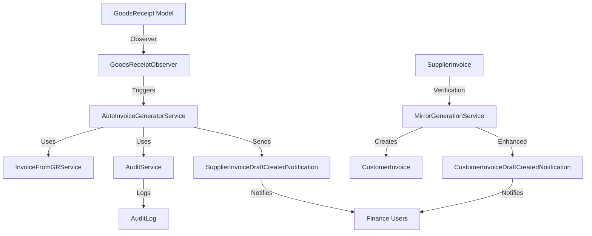
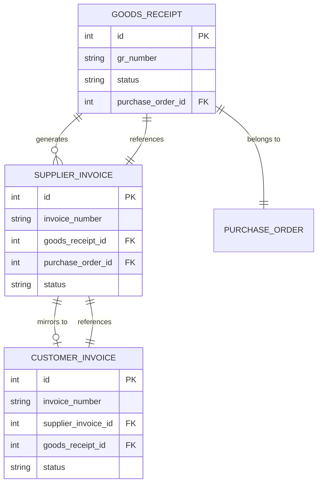

# Design Document: Auto-Invoice from Goods Receipt

## Overview

This feature automates invoice generation after Goods Receipt (GR) completion. When a GR transitions to 'completed' status, the system automatically creates a draft Supplier Invoice (AP) and sends targeted notifications to Finance users. After Finance verifies the Supplier Invoice, the existing MirrorGenerationService automatically creates a draft Customer Invoice (AR) with enhanced Finance notifications.

### Key Design Principles

1. **Non-Blocking**: Auto-invoice generation failures must not block GR completion
2. **Reuse Existing Services**: Leverage InvoiceFromGRService and MirrorGenerationService
3. **Targeted Notifications**: Send actionable notifications only to Finance users
4. **Audit Trail**: Log all auto-generation events for compliance
5. **Graceful Degradation**: Handle errors without disrupting core workflows

### Business Flow

```
GR Completed → Auto-Generate AP Draft → Notify Finance (AP)
                                              ↓
                                    Finance Verifies AP
                                              ↓
                              Auto-Generate AR Draft (existing)
                                              ↓
                                    Notify Finance (AR)
                                              ↓
                                    Finance Issues AR to RS/Klinik
```

## Architecture

### High-Level Component Diagram



### Integration Points

1. **GoodsReceiptService**: Triggers auto-invoice after GR completion
2. **InvoiceFromGRService**: Creates Supplier Invoice from GR
3. **MirrorGenerationService**: Creates Customer Invoice from verified AP (existing)
4. **AuditService**: Records all auto-generation events
5. **Notification System**: Sends targeted Finance notifications

## Components and Interfaces

### 1. AutoInvoiceGeneratorService

**Purpose**: Orchestrates automatic creation of draft Supplier Invoices from completed GRs.

**Location**: `app/Services/AutoInvoiceGeneratorService.php`

**Dependencies**:
- `InvoiceFromGRService`: For invoice creation logic
- `AuditService`: For audit logging
- `Illuminate\Support\Facades\Log`: For error logging
- `Illuminate\Support\Facades\Notification`: For sending notifications

**Public Methods**:

```php
class AutoInvoiceGeneratorService
{
    public function __construct(
        private readonly InvoiceFromGRService $invoiceFromGRService,
        private readonly AuditService $auditService,
    ) {}

    /**
     * Generate draft Supplier Invoice from completed GR
     * 
     * @param GoodsReceipt $gr
     * @return SupplierInvoice|null Returns null if generation fails
     */
    public function generateSupplierInvoiceFromGR(GoodsReceipt $gr): ?SupplierInvoice;

    /**
     * Check if draft Supplier Invoice already exists for GR
     * 
     * @param GoodsReceipt $gr
     * @return bool
     */
    public function draftExists(GoodsReceipt $gr): bool;

    /**
     * Prepare line items from GR items for invoice creation
     * 
     * @param GoodsReceipt $gr
     * @return array
     */
    private function prepareLineItemsFromGR(GoodsReceipt $gr): array;

    /**
     * Send notification to Finance users
     * 
     * @param SupplierInvoice $invoice
     * @param GoodsReceipt $gr
     * @return void
     */
    private function notifyFinanceUsers(SupplierInvoice $invoice, GoodsReceipt $gr): void;
}
```

**Algorithm**:

```php
public function generateSupplierInvoiceFromGR(GoodsReceipt $gr): ?SupplierInvoice
{
    try {
        // Guard 1: Check if draft already exists
        if ($this->draftExists($gr)) {
            Log::warning('Draft Supplier Invoice already exists', [
                'gr_id' => $gr->id,
                'gr_number' => $gr->gr_number,
            ]);
            return null;
        }

        // Guard 2: GR must be completed
        if (!$gr->isCompleted()) {
            Log::warning('GR is not completed', [
                'gr_id' => $gr->id,
                'status' => $gr->status,
            ]);
            return null;
        }

        // Prepare line items from GR
        $lineItems = $this->prepareLineItemsFromGR($gr);

        // Create draft Supplier Invoice using existing service
        $invoice = $this->invoiceFromGRService->createSupplierInvoiceFromGR(
            gr: $gr,
            actor: User::find(1), // System user
            items: $lineItems,
            metadata: [
                'due_date' => now()->addDays(30),
                'notes' => 'Auto-generated from GR completion',
            ]
        );

        // Audit log
        $this->auditService->log(
            action: 'supplier_invoice.auto_created_from_gr',
            entityType: SupplierInvoice::class,
            entityId: $invoice->id,
            metadata: [
                'gr_id' => $gr->id,
                'gr_number' => $gr->gr_number,
                'po_id' => $gr->purchase_order_id,
                'po_number' => $gr->purchaseOrder->po_number,
                'total_amount' => $invoice->total_amount,
                'line_items_count' => count($lineItems),
            ],
            userId: 1, // System user
        );

        // Send notification to Finance
        $this->notifyFinanceUsers($invoice, $gr);

        return $invoice;

    } catch (\Throwable $e) {
        // Non-blocking: log error but don't throw
        Log::error('Failed to auto-generate Supplier Invoice', [
            'gr_id' => $gr->id,
            'gr_number' => $gr->gr_number,
            'error' => $e->getMessage(),
            'trace' => $e->getTraceAsString(),
        ]);
        return null;
    }
}
```

### 2. GoodsReceiptObserver

**Purpose**: Listen to GoodsReceipt model events and trigger auto-invoice generation.

**Location**: `app/Observers/GoodsReceiptObserver.php`

**Events**:
- `updated`: Detect status transition to 'completed'

**Implementation**:

```php
class GoodsReceiptObserver
{
    public function __construct(
        private readonly AutoInvoiceGeneratorService $autoInvoiceGenerator,
    ) {}

    /**
     * Handle the GoodsReceipt "updated" event.
     */
    public function updated(GoodsReceipt $gr): void
    {
        // Detect status transition to 'completed'
        if ($gr->wasChanged('status') && $gr->status === GoodsReceipt::STATUS_COMPLETED) {
            // Trigger auto-invoice generation (non-blocking)
            $this->autoInvoiceGenerator->generateSupplierInvoiceFromGR($gr);
        }
    }
}
```

**Registration**: Add to `app/Providers/EventServiceProvider.php`:

```php
protected $observers = [
    GoodsReceipt::class => [GoodsReceiptObserver::class],
];
```

### 3. SupplierInvoiceDraftCreatedNotification

**Purpose**: Notify Finance users when a draft Supplier Invoice is auto-created.

**Location**: `app/Notifications/SupplierInvoiceDraftCreatedNotification.php`

**Channels**: `database`, `mail`

**Implementation**:

```php
class SupplierInvoiceDraftCreatedNotification extends Notification
{
    use Queueable;

    public function __construct(
        private readonly SupplierInvoice $invoice,
        private readonly GoodsReceipt $gr,
    ) {}

    public function via(object $notifiable): array
    {
        return ['database', 'mail'];
    }

    public function toMail(object $notifiable): MailMessage
    {
        $poNumber = $this->gr->purchaseOrder?->po_number ?? 'Unknown';
        
        return (new MailMessage)
            ->subject("Invoice Pemasok Perlu Dilengkapi — GR #{$this->gr->gr_number}")
            ->greeting("Hello {$notifiable->name},")
            ->line("Draft Invoice Pemasok telah dibuat otomatis untuk Goods Receipt yang telah selesai.")
            ->line("**Invoice Number:** {$this->invoice->invoice_number}")
            ->line("**GR Number:** {$this->gr->gr_number}")
            ->line("**PO Number:** {$poNumber}")
            ->line("**Total Amount:** Rp " . number_format($this->invoice->total_amount, 0, ',', '.'))
            ->line("Silakan lengkapi nomor invoice distributor, tanggal invoice, dan bukti pembayaran.")
            ->action('Lengkapi Invoice', route('web.invoices.supplier.show', $this->invoice))
            ->salutation("Regards, Medikindo PO System");
    }

    public function toArray(object $notifiable): array
    {
        $poNumber = $this->gr->purchaseOrder?->po_number ?? 'Unknown';

        return [
            'invoice_id' => $this->invoice->id,
            'invoice_number' => $this->invoice->invoice_number,
            'gr_id' => $this->gr->id,
            'gr_number' => $this->gr->gr_number,
            'po_number' => $poNumber,
            'title' => 'Invoice Pemasok Perlu Dilengkapi',
            'message' => "Draft Invoice Pemasok {$this->invoice->invoice_number} telah dibuat otomatis untuk GR {$this->gr->gr_number}. Silakan lengkapi nomor invoice distributor, tanggal invoice, dan bukti pembayaran.",
            'url' => route('web.invoices.supplier.show', $this->invoice),
            'icon' => 'info',
            'type' => 'info',
            'notification_type' => 'supplier_invoice_draft_created',
        ];
    }
}
```

### 4. CustomerInvoiceDraftCreatedNotification

**Purpose**: Notify Finance users when a draft Customer Invoice is auto-created from verified AP.

**Location**: `app/Notifications/CustomerInvoiceDraftCreatedNotification.php`

**Channels**: `database`, `mail`

**Implementation**:

```php
class CustomerInvoiceDraftCreatedNotification extends Notification
{
    use Queueable;

    public function __construct(
        private readonly CustomerInvoice $invoice,
        private readonly SupplierInvoice $supplierInvoice,
    ) {}

    public function via(object $notifiable): array
    {
        return ['database', 'mail'];
    }

    public function toMail(object $notifiable): MailMessage
    {
        $orgName = $this->invoice->organization?->name ?? 'Unknown';
        
        return (new MailMessage)
            ->subject("Tagihan ke RS/Klinik Siap Diterbitkan — {$orgName}")
            ->greeting("Hello {$notifiable->name},")
            ->line("Draft Tagihan ke RS/Klinik telah dibuat otomatis setelah verifikasi Invoice Pemasok.")
            ->line("**Invoice Number:** {$this->invoice->invoice_number}")
            ->line("**Customer:** {$orgName}")
            ->line("**Supplier Invoice:** {$this->supplierInvoice->invoice_number}")
            ->line("**Total Amount:** Rp " . number_format($this->invoice->total_amount, 0, ',', '.'))
            ->line("Silakan review dan terbitkan tagihan ini ke RS/Klinik.")
            ->action('Review Tagihan', route('web.invoices.customer.show', $this->invoice))
            ->salutation("Regards, Medikindo PO System");
    }

    public function toArray(object $notifiable): array
    {
        $orgName = $this->invoice->organization?->name ?? 'Unknown';

        return [
            'invoice_id' => $this->invoice->id,
            'invoice_number' => $this->invoice->invoice_number,
            'supplier_invoice_id' => $this->supplierInvoice->id,
            'supplier_invoice_number' => $this->supplierInvoice->invoice_number,
            'organization_name' => $orgName,
            'title' => 'Tagihan ke RS/Klinik Siap Diterbitkan',
            'message' => "Draft Tagihan {$this->invoice->invoice_number} untuk {$orgName} telah dibuat otomatis. Silakan review dan terbitkan ke RS/Klinik.",
            'url' => route('web.invoices.customer.show', $this->invoice),
            'icon' => 'info',
            'type' => 'info',
            'notification_type' => 'customer_invoice_draft_created',
        ];
    }
}
```

### 5. Enhanced MirrorGenerationService

**Changes**: Replace generic `NewInvoiceNotification` with specific `CustomerInvoiceDraftCreatedNotification`.

**Modified Method**:

```php
private function notifyFinanceStaff(CustomerInvoice $invoice): void
{
    try {
        $financeUsers = \App\Models\User::permission('view_customer_invoices')->get();

        if ($financeUsers->isNotEmpty()) {
            // Use specific notification instead of generic NewInvoiceNotification
            Notification::send(
                $financeUsers, 
                new CustomerInvoiceDraftCreatedNotification($invoice, $invoice->supplierInvoice)
            );
        }
    } catch (\Throwable $e) {
        Log::warning('MirrorGenerationService: Failed to dispatch notification', [
            'invoice_id' => $invoice->id,
            'error' => $e->getMessage(),
        ]);
    }
}
```

## Data Models

### Database Schema Changes

**No new tables required**. All data is stored in existing tables:

- `supplier_invoices`: Stores auto-generated AP invoices
- `customer_invoices`: Stores auto-generated AR invoices
- `audit_logs`: Stores auto-generation audit trail
- `notifications`: Stores Finance notifications

### Key Relationships



## Error Handling

### Error Handling Strategy

1. **Non-Blocking Failures**: Auto-invoice generation failures must not block GR completion
2. **Comprehensive Logging**: Log all errors with full context
3. **Graceful Degradation**: Return null on failure, allow manual invoice creation
4. **Notification Resilience**: Notification failures don't rollback invoice creation

### Error Scenarios

| Scenario | Handling | Recovery |
|----------|----------|----------|
| Duplicate invoice exists | Log warning, skip creation | Manual verification |
| GR not completed | Log warning, skip creation | Wait for GR completion |
| Invoice creation fails | Log error, return null | Manual invoice creation |
| Notification fails | Log warning, continue | Check notification logs |
| Database constraint violation | Log error, skip creation | Manual investigation |
| Permission denied | Log error, skip creation | Check user permissions |

### Error Logging Format

```php
Log::error('Failed to auto-generate Supplier Invoice', [
    'gr_id' => $gr->id,
    'gr_number' => $gr->gr_number,
    'po_id' => $gr->purchase_order_id,
    'error' => $e->getMessage(),
    'trace' => $e->getTraceAsString(),
    'timestamp' => now()->toIso8601String(),
]);
```

## Testing Strategy

### Unit Tests

**Test Coverage**:
- `AutoInvoiceGeneratorService::generateSupplierInvoiceFromGR()`
- `AutoInvoiceGeneratorService::draftExists()`
- `AutoInvoiceGeneratorService::prepareLineItemsFromGR()`
- `GoodsReceiptObserver::updated()`
- Notification classes: `toArray()`, `toMail()`

**Example Unit Tests**:

```php
class AutoInvoiceGeneratorServiceTest extends TestCase
{
    public function test_generates_supplier_invoice_from_completed_gr()
    {
        $gr = GoodsReceipt::factory()->completed()->create();
        $service = app(AutoInvoiceGeneratorService::class);
        
        $invoice = $service->generateSupplierInvoiceFromGR($gr);
        
        $this->assertNotNull($invoice);
        $this->assertEquals($gr->id, $invoice->goods_receipt_id);
        $this->assertEquals('draft', $invoice->status);
    }

    public function test_skips_generation_if_draft_exists()
    {
        $gr = GoodsReceipt::factory()->completed()->create();
        SupplierInvoice::factory()->draft()->create(['goods_receipt_id' => $gr->id]);
        
        $service = app(AutoInvoiceGeneratorService::class);
        $invoice = $service->generateSupplierInvoiceFromGR($gr);
        
        $this->assertNull($invoice);
    }

    public function test_handles_invoice_creation_failure_gracefully()
    {
        $gr = GoodsReceipt::factory()->partial()->create(); // Invalid status
        $service = app(AutoInvoiceGeneratorService::class);
        
        $invoice = $service->generateSupplierInvoiceFromGR($gr);
        
        $this->assertNull($invoice); // Should not throw exception
    }
}
```

### Integration Tests

**Test Scenarios**:
1. Complete GR → Auto-generate AP → Verify AP → Auto-generate AR
2. Partial GR → No auto-generation
3. Duplicate prevention
4. Notification delivery
5. Audit trail verification

**Example Integration Test**:

```php
class AutoInvoiceIntegrationTest extends TestCase
{
    public function test_complete_flow_from_gr_to_ar()
    {
        // Setup
        $gr = GoodsReceipt::factory()->partial()->create();
        
        // Act: Complete GR
        $gr->update(['status' => GoodsReceipt::STATUS_COMPLETED]);
        
        // Assert: AP created
        $this->assertDatabaseHas('supplier_invoices', [
            'goods_receipt_id' => $gr->id,
            'status' => 'draft',
        ]);
        
        // Act: Verify AP
        $ap = SupplierInvoice::where('goods_receipt_id', $gr->id)->first();
        $ap->update(['status' => 'verified']);
        
        // Assert: AR created
        $this->assertDatabaseHas('customer_invoices', [
            'supplier_invoice_id' => $ap->id,
            'status' => 'draft',
        ]);
        
        // Assert: Notifications sent
        $this->assertDatabaseHas('notifications', [
            'type' => SupplierInvoiceDraftCreatedNotification::class,
        ]);
        $this->assertDatabaseHas('notifications', [
            'type' => CustomerInvoiceDraftCreatedNotification::class,
        ]);
    }
}
```

### Manual Testing Checklist

- [ ] Complete GR triggers AP draft creation
- [ ] Finance receives AP notification with action link
- [ ] AP notification includes GR number, PO number, invoice number
- [ ] Verify AP triggers AR draft creation (existing flow)
- [ ] Finance receives AR notification with action link
- [ ] AR notification includes customer name, AP number, invoice number
- [ ] Duplicate AP prevention works
- [ ] Partial GR does not trigger auto-generation
- [ ] Manual invoice creation still works
- [ ] Error handling doesn't block GR completion
- [ ] Audit logs are created correctly

## Deployment Considerations

### Migration Steps

1. **Create Observer**: `php artisan make:observer GoodsReceiptObserver --model=GoodsReceipt`
2. **Create Service**: `app/Services/AutoInvoiceGeneratorService.php`
3. **Create Notifications**: 
   - `app/Notifications/SupplierInvoiceDraftCreatedNotification.php`
   - `app/Notifications/CustomerInvoiceDraftCreatedNotification.php`
4. **Register Observer**: Add to `EventServiceProvider`
5. **Update MirrorGenerationService**: Replace notification class
6. **Run Tests**: `php artisan test --filter=AutoInvoice`
7. **Deploy**: Standard deployment process

### Rollback Plan

If issues arise:
1. Remove observer registration from `EventServiceProvider`
2. Revert `MirrorGenerationService` notification changes
3. Manual invoice creation remains functional
4. No database rollback needed (no schema changes)

### Monitoring

**Metrics to Track**:
- Auto-generated AP invoice count (daily)
- Auto-generated AR invoice count (daily)
- Auto-generation failure rate
- Notification delivery success rate
- Average time from GR completion to AP creation

**Alerts**:
- Alert if auto-generation failure rate > 5%
- Alert if notification delivery fails > 10 times/day
- Alert if no auto-invoices generated for 24 hours (potential system issue)

## Security Considerations

### Permission Checks

- **Auto-generation**: Uses system user (ID 1) with full permissions
- **Notifications**: Only sent to users with `view_supplier_invoices` or `view_customer_invoices` permissions
- **Manual Override**: Finance users can still manually create invoices

### Audit Trail

All auto-generation events are logged with:
- Action: `supplier_invoice.auto_created_from_gr` or `customer_invoice.auto_created_from_ap`
- Entity type and ID
- User ID (system user)
- Metadata: GR ID, PO ID, invoice numbers, amounts
- Timestamp

### Data Integrity

- **Immutability**: Auto-generated invoices respect existing immutability rules
- **Anti-Phantom Billing**: AR only created from verified AP (existing guard)
- **Duplicate Prevention**: Check for existing drafts before creation
- **Quantity Validation**: Reuse existing validation in `InvoiceFromGRService`

## Performance Considerations

### Optimization Strategies

1. **Async Notifications**: Queue notification sending to avoid blocking
2. **Batch Processing**: If multiple GRs complete simultaneously, process in queue
3. **Database Indexing**: Ensure indexes on `goods_receipt_id` in invoice tables
4. **Caching**: Cache Finance user list for notification targeting

### Expected Load

- **GR Completions**: ~50-100 per day
- **Auto-invoices**: ~50-100 AP + ~50-100 AR per day
- **Notifications**: ~200-400 per day (2 per invoice × 2-4 Finance users)

### Scalability

- Service is stateless, scales horizontally
- Observer pattern is lightweight
- Notification queuing handles spikes
- No additional database tables needed

---

**Document Version**: 1.0  
**Last Updated**: 2024-01-XX  
**Author**: Kiro AI Agent  
**Status**: Ready for Review
