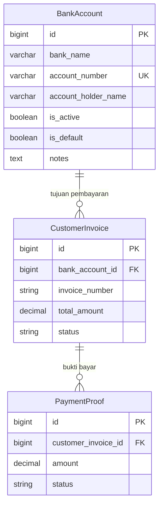

# Design Document — Bank Account

## Overview

Fitur Bank Account menambahkan kemampuan manajemen rekening bank milik Medikindo ke dalam sistem. Super Admin dapat membuat, mengubah, menonaktifkan, dan menghapus rekening bank. Rekening ini kemudian dapat dipilih pada Customer Invoice sebagai tujuan transfer pembayaran, sehingga RS/Klinik mengetahui ke mana harus mentransfer saat mengisi Payment Proof.

Alur utama:
```
Super Admin CRUD BankAccount
    → CustomerInvoice pilih BankAccount (auto-fill default)
    → RS/Klinik lihat nomor rekening saat submit PaymentProof
```

Fitur ini bersifat **global** (tidak terikat ke satu Organization), karena rekening bank adalah milik Medikindo sendiri, bukan milik RS/Klinik. Oleh karena itu model `BankAccount` **tidak** menggunakan trait `BelongsToOrganization`.

---

## Architecture

Fitur ini mengikuti pola MVC yang sudah ada di sistem:

```
routes/web.php
    └── BankAccountWebController (Web/BankAccountWebController.php)
            ├── BankAccountService (Services/BankAccountService.php)
            │       ├── BankAccount (Models/BankAccount.php)
            │       └── AuditService (Services/AuditService.php)
            └── Views (resources/views/bank-accounts/)
                    ├── index.blade.php
                    ├── create.blade.php
                    └── edit.blade.php
```

Perubahan pada model existing:
- `CustomerInvoice` — tambah kolom `bank_account_id` (FK nullable) dan relasi `bankAccount()`
- `PaymentProof` — tidak ada perubahan model; view-nya membaca `customerInvoice->bankAccount`

---

## Components and Interfaces

### BankAccount Model

`app/Models/BankAccount.php`

- Tidak menggunakan `BelongsToOrganization` (rekening bersifat global)
- Tidak menggunakan `SoftDeletes` (hard delete, tapi dilindungi oleh cek referensi)
- Relasi `customerInvoices()` → `HasMany` ke `CustomerInvoice`
- Scope `active()` → filter `is_active = true`

### BankAccountService

`app/Services/BankAccountService.php`

Memusatkan logika bisnis agar controller tetap tipis:

| Method | Deskripsi |
|---|---|
| `create(array $data): BankAccount` | Buat rekening baru, log audit |
| `update(BankAccount $account, array $data): BankAccount` | Update rekening, log audit |
| `setDefault(BankAccount $account): void` | Set default (unset semua lainnya dalam satu transaksi DB) |
| `deactivate(BankAccount $account): void` | Set `is_active = false`, clear `is_default` jika perlu, log audit |
| `activate(BankAccount $account): void` | Set `is_active = true`, log audit |
| `delete(BankAccount $account): void` | Hard delete jika tidak ada referensi, log audit |
| `getActiveAccounts(): Collection` | Ambil semua rekening aktif untuk dropdown |
| `getDefaultAccount(): ?BankAccount` | Ambil rekening default (atau null) |

### BankAccountWebController

`app/Http/Controllers/Web/BankAccountWebController.php`

Route resource standard + action tambahan:

| Method | Route | Permission |
|---|---|---|
| `index` | GET /bank-accounts | `manage_bank_accounts` |
| `create` | GET /bank-accounts/create | `manage_bank_accounts` |
| `store` | POST /bank-accounts | `manage_bank_accounts` |
| `edit` | GET /bank-accounts/{id}/edit | `manage_bank_accounts` |
| `update` | PUT /bank-accounts/{id} | `manage_bank_accounts` |
| `destroy` | DELETE /bank-accounts/{id} | `manage_bank_accounts` |
| `setDefault` | PATCH /bank-accounts/{id}/set-default | `manage_bank_accounts` |
| `toggleActive` | PATCH /bank-accounts/{id}/toggle-active | `manage_bank_accounts` |

### StoreBankAccountRequest / UpdateBankAccountRequest

`app/Http/Requests/StoreBankAccountRequest.php`
`app/Http/Requests/UpdateBankAccountRequest.php`

Validasi:
- `bank_name`: required, string, max:100
- `account_number`: required, string, max:30, unique:bank_accounts (ignore self on update)
- `account_holder_name`: required, string, max:100
- `notes`: nullable, string

### Perubahan CustomerInvoice

- Migration baru: tambah kolom `bank_account_id` (FK nullable, nullOnDelete) ke tabel `customer_invoices`
- Model: tambah relasi `bankAccount(): BelongsTo`
- Controller `InvoiceWebController`: saat `createCustomer`, inject `BankAccountService` untuk mendapatkan default account dan daftar active accounts
- View `invoices/customer/create.blade.php`: tambah dropdown `bank_account_id`
- View `invoices/customer/show.blade.php` dan PDF: tampilkan detail rekening atau placeholder

### Perubahan PaymentProof View

- View `payment-proofs/create.blade.php`: tampilkan info rekening dari `$invoice->bankAccount` sebagai read-only

---

## Data Models

### Tabel `bank_accounts` (baru)

```sql
CREATE TABLE bank_accounts (
    id                  BIGINT UNSIGNED AUTO_INCREMENT PRIMARY KEY,
    bank_name           VARCHAR(100) NOT NULL,
    account_number      VARCHAR(30)  NOT NULL UNIQUE,
    account_holder_name VARCHAR(100) NOT NULL,
    is_active           TINYINT(1)   NOT NULL DEFAULT 1,
    is_default          TINYINT(1)   NOT NULL DEFAULT 0,
    notes               TEXT         NULL,
    created_at          TIMESTAMP    NULL,
    updated_at          TIMESTAMP    NULL
);
```

Tidak ada `deleted_at` — hard delete dengan proteksi referensi.

### Perubahan Tabel `customer_invoices`

```sql
ALTER TABLE customer_invoices
    ADD COLUMN bank_account_id BIGINT UNSIGNED NULL,
    ADD CONSTRAINT fk_ci_bank_account
        FOREIGN KEY (bank_account_id) REFERENCES bank_accounts(id)
        ON DELETE SET NULL;
```

`ON DELETE SET NULL` memastikan jika rekening dihapus (yang hanya bisa terjadi jika tidak ada referensi aktif), invoice lama tidak rusak.

### Diagram Relasi



---

## Correctness Properties

*A property is a characteristic or behavior that should hold true across all valid executions of a system — essentially, a formal statement about what the system should do. Properties serve as the bridge between human-readable specifications and machine-verifiable correctness guarantees.*

### Property 1: Uniqueness of account_number

*For any* two bank account records in the system, their `account_number` values must be distinct — attempting to create or update a bank account with an `account_number` that already exists in another record must be rejected with a validation error.

**Validates: Requirements 1.2, 6.1**

---

### Property 2: Deletion invariant based on invoice references

*For any* bank account, it can be permanently deleted if and only if no `CustomerInvoice` record references it via `bank_account_id`. Attempting to delete a referenced account must be rejected; deleting an unreferenced account must succeed and remove the record.

**Validates: Requirements 1.5, 1.6**

---

### Property 3: At most one default account at any time

*For any* sequence of set-default operations on any bank accounts, the count of records with `is_default = true` must never exceed 1. After any set-default operation completes, exactly one account has `is_default = true` (the one just set), and all others have `is_default = false`.

**Validates: Requirements 2.1, 2.2**

---

### Property 4: Inactive accounts cannot be set as default

*For any* bank account with `is_active = false`, attempting to set it as the default account must be rejected with a validation error. The `is_default` flag must remain unchanged.

**Validates: Requirements 2.3**

---

### Property 5: Deactivation preserves record and clears default

*For any* bank account, after a deactivate operation: (a) the record still exists in the database, (b) `is_active` is `false`, and (c) if the account was previously the default (`is_default = true`), then `is_default` is now `false`.

**Validates: Requirements 3.1, 3.2**

---

### Property 6: Active accounts list never contains inactive accounts

*For any* collection of bank accounts with mixed `is_active` values, the result of `BankAccountService::getActiveAccounts()` must contain only records where `is_active = true`. No inactive account should ever appear in the dropdown list for CustomerInvoice forms.

**Validates: Requirements 3.3, 4.3**

---

### Property 7: Deactivation does not affect existing invoice references

*For any* `CustomerInvoice` with a non-null `bank_account_id`, deactivating the referenced bank account must not change the invoice's `bank_account_id`. The invoice must continue to display the bank account details.

**Validates: Requirements 3.4, 4.6**

---

### Property 8: Default account pre-populates new invoices

*For any* active bank account marked as default, creating a new `CustomerInvoice` without explicitly specifying a `bank_account_id` must result in the invoice's `bank_account_id` being set to that default account's id.

**Validates: Requirements 4.2**

---

### Property 9: Bank account association round-trip on invoice

*For any* active bank account, saving a `CustomerInvoice` with that `bank_account_id` and then loading the invoice with its `bankAccount` relation must return the same `bank_name`, `account_number`, and `account_holder_name`.

**Validates: Requirements 4.4, 5.1**

---

### Property 10: Field length validation

*For any* string with length greater than its defined maximum (100 for `bank_name`, 30 for `account_number`, 100 for `account_holder_name`), the validation layer must reject the request with a validation error for that field.

**Validates: Requirements 6.2, 6.3, 6.4**

---

### Property 11: All CRUD operations produce audit log entries

*For any* create, update, deactivate, or delete operation on a `BankAccount`, an entry must be written to the `audit_logs` table containing the correct `action` string, the `entity_id` of the affected record, and the `user_id` of the actor.

**Validates: Requirements 6.6**

---

## Error Handling

| Skenario | Penanganan |
|---|---|
| Duplikat `account_number` | Validasi Laravel mengembalikan error "Nomor rekening sudah terdaftar" |
| Hapus rekening yang direferensi invoice | Controller menangkap exception dari service, redirect dengan flash error |
| Set inactive account sebagai default | Service melempar `\InvalidArgumentException`, controller redirect dengan flash error |
| Akses tanpa permission `manage_bank_accounts` | Middleware `can:manage_bank_accounts` mengembalikan HTTP 403 |
| Field melebihi panjang maksimum | Form Request validation mengembalikan error per field |
| DB transaction gagal saat set-default | `DB::transaction()` rollback otomatis, exception di-catch di controller |

---

## Testing Strategy

### Unit Tests (PHPUnit)

Fokus pada `BankAccountService` dengan mock database:

- **Example**: Create bank account dengan data valid → record tersimpan
- **Example**: Update bank account → perubahan tersimpan
- **Example**: Invoice tanpa `bank_account_id` → placeholder text tampil
- **Example**: Non-super-admin akses halaman → HTTP 403
- **Example**: Payment proof form dengan invoice tanpa rekening → teks "Rekening belum ditentukan — hubungi Medikindo"
- **Example**: Bank account field read-only pada payment proof form

### Property-Based Tests (PHPUnit + [eris](https://github.com/giorgiosironi/eris) atau manual generator)

Setiap property test dijalankan minimum 100 iterasi dengan input yang di-generate secara acak.

Tag format: `Feature: bank-account, Property {N}: {property_text}`

| Property | Test | Generator |
|---|---|---|
| P1: Uniqueness | Generate random account_number, insert twice, assert second fails | Random alphanumeric strings |
| P2: Deletion invariant | Generate account with/without invoice refs, assert delete behavior | Random bool: has_references |
| P3: At most one default | Generate N accounts, set-default on random one, assert count(is_default=true) == 1 | Random account selection |
| P4: Inactive cannot be default | Generate inactive account, attempt set-default, assert rejected | Random inactive accounts |
| P5: Deactivation preserves record | Generate active/default accounts, deactivate, assert record exists + flags | Random is_default bool |
| P6: Active list excludes inactive | Generate mixed accounts, call getActiveAccounts(), assert no inactive in result | Random is_active distribution |
| P7: Deactivation preserves invoice refs | Generate invoice with bank_account_id, deactivate account, assert invoice unchanged | Random invoice data |
| P8: Default pre-populates invoice | Generate default account, create invoice, assert bank_account_id matches | Random default account |
| P9: Association round-trip | Generate bank account, save invoice with it, load relation, assert fields match | Random bank account data |
| P10: Field length validation | Generate strings of length > max, assert validation rejects | Random strings > max length |
| P11: Audit log on CRUD | Perform random CRUD operation, assert audit_logs entry exists | Random operation type |

### Integration Tests

- GET `/bank-accounts` → halaman index tampil dengan tabel
- POST `/bank-accounts` dengan data valid → redirect ke index dengan success flash
- DELETE `/bank-accounts/{id}` yang direferensi → redirect dengan error flash
- CustomerInvoice create form → dropdown hanya menampilkan active accounts
- PaymentProof create form → bank account info tampil read-only
