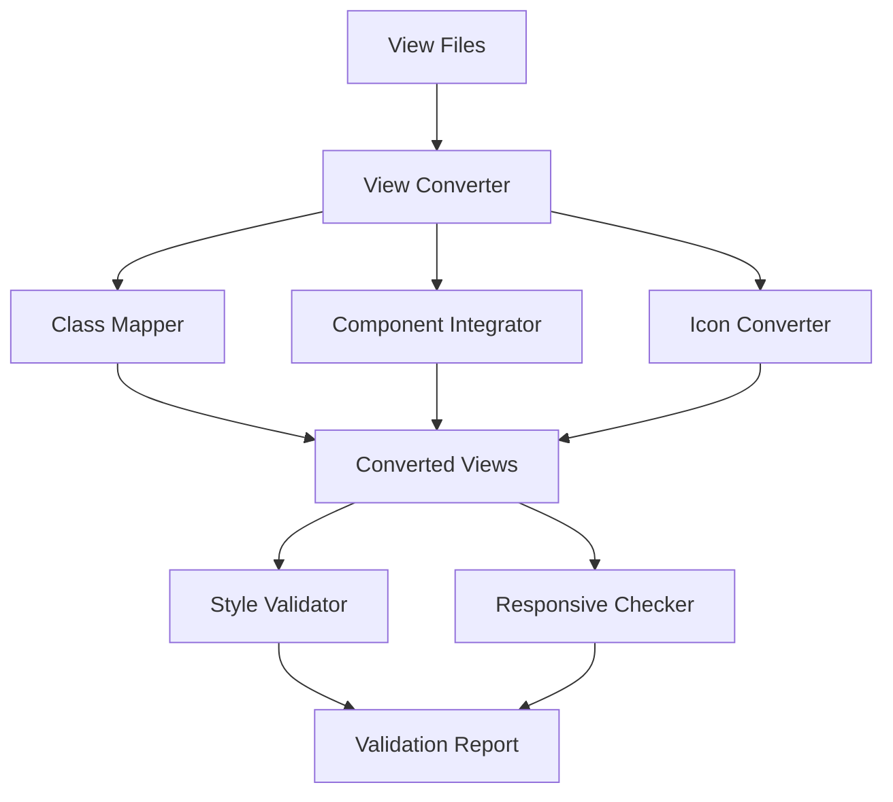
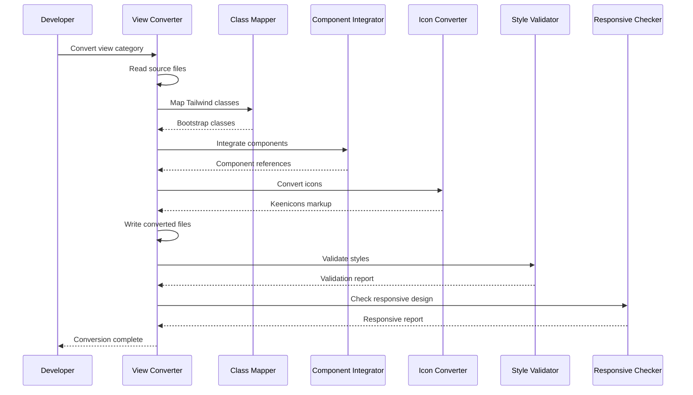

# Design Document: Tailwind to Bootstrap Conversion

## Overview

This design document outlines the technical approach for converting all Laravel Blade views in the Medikindo Procurement System from Tailwind CSS to Bootstrap 5 with Metronic 8 theme styling. The conversion will be executed systematically across 12 view categories, ensuring visual consistency, functional integrity, and responsive design while eliminating all Tailwind CSS dependencies.

### Goals

1. **Complete CSS Framework Migration**: Replace all Tailwind CSS classes with Bootstrap 5 and Metronic 8 equivalents
2. **Visual Consistency**: Achieve uniform design language across all application views using Metronic 8 patterns
3. **Functional Preservation**: Maintain 100% of existing functionality including forms, navigation, data display, and user interactions
4. **Responsive Design**: Ensure all views work correctly across mobile (< 576px), tablet (≥ 768px), and desktop (≥ 992px) breakpoints
5. **Zero Tailwind Residue**: Eliminate all Tailwind CSS classes, configuration files, and dependencies

### Scope

**In Scope:**
- Conversion of 12 view categories: Dashboard, Purchase Orders, Approvals, Goods Receipts, Invoices, Payments, Financial Controls, Organizations, Suppliers, Products, Users, Notifications
- Icon system migration from SVG/custom icons to Keenicons
- Integration with existing Bootstrap Blade components (button, input, select, textarea, table)
- Responsive design validation across all breakpoints
- Accessibility compliance maintenance
- Empty state, pagination, alert, and notification styling standardization

**Out of Scope:**
- Backend logic modifications
- Database schema changes
- API endpoint modifications
- Authentication/authorization logic changes
- Business rule modifications
- New feature development

### Constraints

- Must maintain all existing functionality without regression
- Must preserve all Blade directives, route references, and permission checks
- Must follow patterns established in BOOTSTRAP_QUICK_REFERENCE.md
- Must reference existing converted views (purchase-orders/index.blade.php) as templates
- Must complete conversion in priority order (Dashboard → Purchase Orders → ... → Notifications)
- Must produce zero console errors related to CSS classes

## Architecture

### System Components



### Component Responsibilities

**View Converter**
- Orchestrates the conversion process for each view file
- Reads source Blade files and applies transformations
- Preserves Blade directives, route references, and PHP logic
- Writes converted files back to the same location

**Class Mapper**
- Maintains mapping between Tailwind CSS classes and Bootstrap 5/Metronic 8 equivalents
- Handles utility class transformations (spacing, colors, typography, layout)
- Applies context-aware class selection (e.g., card headers vs. card bodies)

**Component Integrator**
- Identifies opportunities to use existing Blade components
- Replaces inline HTML with component references where appropriate
- Ensures consistent use of Component_Library (button, input, select, textarea, table)

**Icon Converter**
- Transforms SVG icons and custom icon references to Keenicons format
- Applies appropriate sizing classes (fs-1 through fs-7, fs-2x, fs-3x)
- Maintains icon positioning and spacing in buttons and standalone contexts

**Style Validator**
- Scans converted files for remaining Tailwind CSS classes
- Detects Tailwind-specific patterns (arbitrary values, hover:/focus: prefixes)
- Verifies all CSS classes exist in Bootstrap 5 or Metronic 8 stylesheets
- Generates validation reports with file paths and line numbers

**Responsive Checker**
- Validates view rendering at mobile, tablet, and desktop breakpoints
- Verifies responsive utility classes are correctly applied
- Ensures mobile-first approach is maintained
- Tests layout transformations across breakpoints

### Conversion Flow



## Components and Interfaces

### Class Mapping System

The Class Mapper maintains comprehensive mappings between Tailwind CSS and Bootstrap 5/Metronic 8 classes:

**Layout & Flexbox**
```
Tailwind → Bootstrap
flex → d-flex
inline-flex → d-inline-flex
flex-row → flex-row
flex-col → flex-column
items-start → align-items-start
items-center → align-items-center
items-end → align-items-end
justify-start → justify-content-start
justify-center → justify-content-center
justify-between → justify-content-between
justify-end → justify-content-end
gap-1 → gap-1
gap-2 → gap-2
gap-4 → gap-3
gap-6 → gap-4
```

**Spacing**
```
Tailwind → Bootstrap
m-{n} → m-{n} (direct mapping for 0-5)
mt-{n} → mt-{n}
mb-{n} → mb-{n}
ml-{n} → ms-{n} (start instead of left)
mr-{n} → me-{n} (end instead of right)
mx-{n} → mx-{n}
my-{n} → my-{n}
p-{n} → p-{n}
px-6 → px-5 (adjusted to Bootstrap scale)
py-8 → py-7 (adjusted to Bootstrap scale)
```

**Typography**
```
Tailwind → Bootstrap
text-xs → fs-7
text-sm → fs-6
text-base → fs-6
text-lg → fs-5
text-xl → fs-4
text-2xl → fs-3
text-3xl → fs-2
font-normal → fw-normal
font-medium → fw-semibold
font-semibold → fw-semibold
font-bold → fw-bold
text-left → text-start
text-center → text-center
text-right → text-end
```

**Colors**
```
Tailwind → Metronic
text-gray-500 → text-gray-600
text-gray-600 → text-gray-600
text-gray-700 → text-gray-700
text-gray-800 → text-gray-800
text-gray-900 → text-gray-900
text-blue-600 → text-primary
text-green-600 → text-success
text-red-600 → text-danger
text-yellow-600 → text-warning
bg-white → bg-white
bg-gray-50 → bg-light
bg-blue-500 → bg-primary
```

**Display & Visibility**
```
Tailwind → Bootstrap
hidden → d-none
block → d-block
inline → d-inline
inline-block → d-inline-block
sm:block → d-sm-block
md:flex → d-md-flex
lg:hidden → d-lg-none
```

**Grid System**
```
Tailwind → Bootstrap
grid → row
grid-cols-{n} → (use col-{12/n} on children)
col-span-{n} → col-{n}
sm:col-span-{n} → col-sm-{n}
md:col-span-{n} → col-md-{n}
gap-4 → g-4 (on row)
gap-x-4 → gx-4
gap-y-4 → gy-4
```

### Component Integration Patterns

**Button Component Usage**
```blade
<!-- Before (Tailwind) -->
<button class="px-4 py-2 bg-blue-600 text-white rounded hover:bg-blue-700">
    Submit
</button>

<!-- After (Bootstrap Component) -->
<x-button type="submit" variant="primary">
    Submit
</x-button>
```

**Form Input Component Usage**
```blade
<!-- Before (Tailwind) -->
<div class="mb-4">
    <label class="block text-sm font-medium text-gray-700">Name</label>
    <input type="text" class="mt-1 block w-full rounded-md border-gray-300">
</div>

<!-- After (Bootstrap Component) -->
<x-input 
    name="name" 
    label="Name" 
    type="text" 
    required 
/>
```

**Table Component Usage**
```blade
<!-- Before (Tailwind) -->
<table class="min-w-full divide-y divide-gray-200">
    <thead class="bg-gray-50">
        <tr>
            <th class="px-6 py-3 text-left text-xs font-medium text-gray-500 uppercase">
                Name
            </th>
        </tr>
    </thead>
</table>

<!-- After (Bootstrap/Metronic) -->
<div class="table-responsive">
    <table class="table table-row-dashed table-row-gray-300 align-middle gs-0 gy-4">
        <thead>
            <tr class="fw-bold text-muted">
                <th class="min-w-150px">Name</th>
            </tr>
        </thead>
    </table>
</div>
```

### Icon Conversion System

**Icon Mapping Strategy**
```
Common Icon Mappings:
- Plus/Add → ki-plus
- Edit/Pencil → ki-pencil
- Delete/Trash → ki-trash
- View/Eye → ki-eye
- Search → ki-magnifier
- Filter → ki-filter
- Download → ki-download
- Upload → ki-upload
- Check/Success → ki-check-circle
- Error/Cross → ki-cross-circle
- Warning → ki-information
- User → ki-user
- Settings → ki-setting
- Calendar → ki-calendar
- Document → ki-document
```

**Icon Implementation Pattern**
```blade
<!-- In Buttons -->
<button class="btn btn-primary">
    <i class="ki-outline ki-plus fs-3"></i>
    Add New
</button>

<!-- Standalone -->
<i class="ki-outline ki-check-circle fs-2x text-success"></i>

<!-- In Alerts -->
<div class="alert alert-success d-flex align-items-center">
    <i class="ki-outline ki-check-circle fs-2 me-3"></i>
    <span>Success message</span>
</div>
```

## Data Models

### View Category Structure

Each view category follows a consistent file structure:

```
resources/views/{category}/
├── index.blade.php          # List view
├── create.blade.php         # Creation form
├── edit.blade.php           # Edit form
├── show.blade.php           # Detail view
└── partials/
    ├── _form.blade.php      # Shared form fields
    ├── _filters.blade.php   # Filter form
    └── _table.blade.php     # Table component
```

### Conversion Metadata

Each converted view maintains metadata for tracking:

```php
// Embedded as Blade comment at top of file
{{-- 
Conversion Metadata:
- Original: Tailwind CSS
- Converted: Bootstrap 5 + Metronic 8
- Date: {conversion_date}
- Category: {view_category}
- Validated: {yes/no}
--}}
```

### Style Validation Report Structure

```json
{
  "file": "resources/views/dashboard/index.blade.php",
  "status": "pass|fail",
  "tailwind_classes_found": [],
  "unknown_classes": [],
  "warnings": [],
  "responsive_validation": {
    "mobile": "pass|fail",
    "tablet": "pass|fail",
    "desktop": "pass|fail"
  }
}
```

## Error Handling

### Conversion Error Scenarios

**1. Unmapped Tailwind Class**
- **Detection**: Class Mapper encounters a Tailwind class without a Bootstrap equivalent
- **Handling**: Log warning with file path and line number, apply closest Bootstrap equivalent, flag for manual review
- **Recovery**: Developer reviews flagged files and applies appropriate Bootstrap classes

**2. Component Integration Conflict**
- **Detection**: Existing markup structure incompatible with Blade component
- **Handling**: Skip component integration, apply inline Bootstrap classes, log for manual review
- **Recovery**: Developer manually refactors markup to use component or confirms inline approach

**3. Icon Mapping Ambiguity**
- **Detection**: SVG icon or custom icon without clear Keenicons equivalent
- **Handling**: Use generic ki-information icon, log for manual review
- **Recovery**: Developer selects appropriate Keenicons icon based on context

**4. Responsive Breakpoint Mismatch**
- **Detection**: Tailwind breakpoint (sm:, md:, lg:) doesn't align perfectly with Bootstrap breakpoints
- **Handling**: Map to closest Bootstrap breakpoint, log potential visual difference
- **Recovery**: Developer tests responsive behavior and adjusts if necessary

**5. Preserved Tailwind Class**
- **Detection**: Style Validator finds remaining Tailwind classes after conversion
- **Handling**: Generate validation report with file paths and line numbers
- **Recovery**: Developer manually converts remaining classes

### Validation Error Handling

**Style Validation Failures**
```php
// Validation error structure
[
    'file' => 'resources/views/invoices/index.blade.php',
    'line' => 42,
    'issue' => 'Tailwind class found: "flex-col"',
    'suggestion' => 'Replace with: "flex-column"'
]
```

**Responsive Validation Failures**
```php
// Responsive error structure
[
    'file' => 'resources/views/products/index.blade.php',
    'breakpoint' => 'mobile',
    'issue' => 'Horizontal scroll detected',
    'element' => 'table.product-list'
]
```

### Functional Integrity Checks

**Form Submission Validation**
- Verify all form actions point to correct routes
- Ensure CSRF tokens are present
- Confirm validation error display works correctly
- Test file upload functionality if present

**Navigation Validation**
- Verify all route() helper calls resolve correctly
- Ensure permission checks (@can/@cannot) function properly
- Test breadcrumb generation
- Validate active menu state highlighting

**Data Display Validation**
- Confirm Blade loops (@foreach, @forelse) render correctly
- Verify empty state displays when no data present
- Test pagination functionality
- Validate sorting and filtering if present

## Testing Strategy

### Manual Testing Approach

Since this is a UI conversion project without complex algorithms or universal properties, testing will focus on visual validation, functional verification, and responsive design checks.

**1. Visual Regression Testing**
- **Method**: Side-by-side comparison of before/after screenshots
- **Scope**: All 12 view categories across 3 breakpoints (mobile, tablet, desktop)
- **Tools**: Browser DevTools, manual inspection
- **Acceptance**: Visual parity with Metronic 8 design patterns, no layout breaks

**2. Functional Integration Testing**
- **Method**: Manual interaction testing of all user workflows
- **Scope**: 
  - Form submissions (create, edit, delete operations)
  - Navigation (menu links, breadcrumbs, pagination)
  - Filtering and searching
  - Data display (tables, cards, lists)
  - Alerts and notifications
- **Acceptance**: 100% functional parity with pre-conversion behavior

**3. Responsive Design Testing**
- **Method**: Browser DevTools responsive mode + physical device testing
- **Breakpoints**: 
  - Mobile: 375px, 414px (iPhone sizes)
  - Tablet: 768px, 1024px (iPad sizes)
  - Desktop: 1280px, 1920px (common desktop sizes)
- **Acceptance**: No horizontal scroll, readable text, accessible buttons, proper layout stacking

**4. CSS Validation Testing**
- **Method**: Automated scanning for Tailwind CSS classes
- **Tool**: Custom validation script using regex patterns
- **Patterns to detect**:
  - Tailwind utility classes (flex-col, items-center, etc.)
  - Arbitrary values (w-[200px], h-[50px])
  - Tailwind-specific prefixes (hover:, focus:, sm:, md:, lg:)
- **Acceptance**: Zero Tailwind classes found in any converted file

**5. Accessibility Testing**
- **Method**: Manual keyboard navigation + screen reader testing
- **Checks**:
  - All interactive elements keyboard accessible
  - Proper focus states visible
  - ARIA attributes preserved
  - Heading hierarchy maintained
  - Form labels associated with inputs
  - Sufficient color contrast
- **Tools**: Browser DevTools Accessibility panel, WAVE extension
- **Acceptance**: No accessibility regressions from pre-conversion state

**6. Cross-Browser Testing**
- **Browsers**: Chrome, Firefox, Safari, Edge (latest versions)
- **Scope**: Critical user workflows in each view category
- **Acceptance**: Consistent rendering and functionality across all browsers

### Testing Sequence by Priority

Following Requirement 12 (Priority-Based Conversion Sequence), testing will proceed in this order:

1. **Dashboard** → Visual + Functional + Responsive + CSS Validation
2. **Purchase Orders** → Visual + Functional + Responsive + CSS Validation
3. **Approvals** → Visual + Functional + Responsive + CSS Validation
4. **Goods Receipts** → Visual + Functional + Responsive + CSS Validation
5. **Invoices** → Visual + Functional + Responsive + CSS Validation
6. **Payments** → Visual + Functional + Responsive + CSS Validation
7. **Financial Controls** → Visual + Functional + Responsive + CSS Validation
8. **Organizations** → Visual + Functional + Responsive + CSS Validation
9. **Suppliers** → Visual + Functional + Responsive + CSS Validation
10. **Products** → Visual + Functional + Responsive + CSS Validation
11. **Users** → Visual + Functional + Responsive + CSS Validation
12. **Notifications** → Visual + Functional + Responsive + CSS Validation

### Why Property-Based Testing Is Not Applicable

Property-based testing (PBT) is not appropriate for this feature because:

1. **UI Rendering Focus**: This project involves CSS class transformation and visual styling, not algorithmic logic with universal properties
2. **Deterministic Mapping**: Tailwind → Bootstrap class conversion is a fixed mapping, not a function with varying inputs that could reveal edge cases
3. **No Data Transformation Logic**: There are no parsers, serializers, or data transformations that benefit from randomized input testing
4. **Visual Validation Required**: Correctness is determined by visual appearance and user interaction, which cannot be captured in property-based assertions
5. **Better Testing Approaches**: Visual regression tests, manual testing, and CSS validation are more effective for UI conversion validation

Instead, the testing strategy emphasizes:
- **Snapshot/Visual Regression**: Comparing before/after screenshots
- **Manual Testing**: Human verification of visual design and user workflows
- **CSS Validation**: Automated scanning for Tailwind residue
- **Integration Testing**: Verifying functional preservation through user workflows

### Test Execution Checklist

For each view category, complete this checklist:

- [ ] Visual comparison at mobile breakpoint (< 576px)
- [ ] Visual comparison at tablet breakpoint (≥ 768px)
- [ ] Visual comparison at desktop breakpoint (≥ 992px)
- [ ] Form submission test (if applicable)
- [ ] Navigation test (menu links, breadcrumbs)
- [ ] Filter/search test (if applicable)
- [ ] Pagination test (if applicable)
- [ ] Empty state display test
- [ ] Alert/notification display test
- [ ] CSS validation scan (zero Tailwind classes)
- [ ] Accessibility check (keyboard navigation, screen reader)
- [ ] Cross-browser test (Chrome, Firefox, Safari, Edge)

## Implementation Notes

### Conversion Best Practices

1. **Preserve Blade Logic**: Never modify @if, @foreach, @can, @cannot directives during conversion
2. **Maintain Route References**: Keep all route() helper calls unchanged
3. **Reference Documentation**: Always consult BOOTSTRAP_QUICK_REFERENCE.md for class mappings
4. **Use Existing Patterns**: Follow patterns from resources/views/purchase-orders/index.blade.php
5. **Component First**: Prefer Blade components over inline HTML when possible
6. **Responsive Mobile-First**: Apply base classes first, then responsive overrides (col-12 col-md-6)
7. **Metronic Patterns**: Use Metronic-specific classes (card-flush, table-row-dashed, badge-light-{color})
8. **Icon Consistency**: Always use ki-outline prefix for Keenicons
9. **Spacing Consistency**: Use Metronic spacing scale (mb-5, mt-7, p-5)
10. **Typography Hierarchy**: Follow Metronic typography (fs-1 to fs-7, fw-bold, fw-semibold)

### Common Conversion Patterns

**Card Conversion**
```blade
<!-- Before (Tailwind) -->
<div class="bg-white rounded-lg shadow p-6">
    <h3 class="text-lg font-semibold mb-4">Title</h3>
    <div>Content</div>
</div>

<!-- After (Bootstrap/Metronic) -->
<div class="card card-flush mb-5">
    <div class="card-header border-0 pt-5">
        <h3 class="card-title fw-bold fs-3">Title</h3>
    </div>
    <div class="card-body pt-0">
        Content
    </div>
</div>
```

**Table Conversion**
```blade
<!-- Before (Tailwind) -->
<table class="min-w-full divide-y divide-gray-200">
    <thead class="bg-gray-50">
        <tr>
            <th class="px-6 py-3 text-left text-xs font-medium text-gray-500 uppercase tracking-wider">
                Name
            </th>
        </tr>
    </thead>
    <tbody class="bg-white divide-y divide-gray-200">
        <tr>
            <td class="px-6 py-4 whitespace-nowrap text-sm text-gray-900">
                Data
            </td>
        </tr>
    </tbody>
</table>

<!-- After (Bootstrap/Metronic) -->
<div class="table-responsive">
    <table class="table table-row-dashed table-row-gray-300 align-middle gs-0 gy-4">
        <thead>
            <tr class="fw-bold text-muted">
                <th class="min-w-150px">Name</th>
            </tr>
        </thead>
        <tbody>
            <tr>
                <td>
                    <span class="text-gray-900 fw-bold d-block fs-6">Data</span>
                </td>
            </tr>
        </tbody>
    </table>
</div>
```

**Filter Form Conversion**
```blade
<!-- Before (Tailwind) -->
<div class="bg-white p-4 rounded-lg shadow mb-6">
    <form class="grid grid-cols-1 md:grid-cols-3 gap-4">
        <div>
            <label class="block text-sm font-medium text-gray-700">Search</label>
            <input type="text" class="mt-1 block w-full rounded-md border-gray-300">
        </div>
        <div class="flex items-end gap-2">
            <button class="px-4 py-2 bg-blue-600 text-white rounded">Filter</button>
            <button class="px-4 py-2 bg-gray-200 text-gray-700 rounded">Reset</button>
        </div>
    </form>
</div>

<!-- After (Bootstrap/Metronic) -->
<div class="card card-flush mb-7">
    <div class="card-body">
        <form class="row g-4">
            <div class="col-md-4">
                <label class="form-label">Search</label>
                <input type="text" class="form-control form-control-solid">
            </div>
            <div class="col-md-8 d-flex align-items-end gap-2">
                <button type="submit" class="btn btn-primary">
                    <i class="ki-outline ki-filter fs-3"></i>
                    Filter
                </button>
                <button type="reset" class="btn btn-light">Reset</button>
            </div>
        </form>
    </div>
</div>
```

**Badge/Status Conversion**
```blade
<!-- Before (Tailwind) -->
<span class="px-2 py-1 text-xs font-semibold rounded-full bg-green-100 text-green-800">
    Approved
</span>

<!-- After (Bootstrap/Metronic) -->
<span class="badge badge-light-success fw-bold">Approved</span>
```

### File Organization

Maintain existing file structure:
```
resources/views/
├── components/
│   ├── layout.blade.php          # Main layout (already converted)
│   ├── button.blade.php          # Button component (already converted)
│   ├── input.blade.php           # Input component (already converted)
│   ├── select.blade.php          # Select component (already converted)
│   ├── textarea.blade.php        # Textarea component (already converted)
│   └── table.blade.php           # Table component (already converted)
├── partials/
│   ├── header.blade.php          # Header (already converted)
│   ├── sidebar.blade.php         # Sidebar (already converted)
│   └── toolbar.blade.php         # Toolbar (already converted)
├── dashboard/
│   └── index.blade.php           # TO CONVERT
├── purchase-orders/
│   ├── index.blade.php           # ALREADY CONVERTED (reference)
│   ├── create.blade.php          # TO CONVERT
│   ├── edit.blade.php            # TO CONVERT
│   └── show.blade.php            # TO CONVERT
└── [other categories]/           # TO CONVERT
```

### Validation Script

Create a validation script to detect remaining Tailwind classes:

```bash
#!/bin/bash
# validate-tailwind-removal.sh

echo "Scanning for Tailwind CSS classes..."

# Patterns to detect
patterns=(
    "flex-col"
    "items-center"
    "justify-between"
    "text-gray-[0-9]"
    "bg-blue-[0-9]"
    "hover:"
    "focus:"
    "sm:"
    "md:"
    "lg:"
    "xl:"
    "w-\["
    "h-\["
)

found=0

for pattern in "${patterns[@]}"; do
    results=$(grep -r "$pattern" resources/views/ --include="*.blade.php" | grep -v "{{--" | grep -v "//")
    if [ ! -z "$results" ]; then
        echo "Found pattern: $pattern"
        echo "$results"
        found=1
    fi
done

if [ $found -eq 0 ]; then
    echo "✓ No Tailwind classes found!"
    exit 0
else
    echo "✗ Tailwind classes detected. Please review and convert."
    exit 1
fi
```

## References

- **Bootstrap 5 Documentation**: https://getbootstrap.com/docs/5.3/
- **Metronic 8 Documentation**: C:\laragon\www\dist\dist (local template)
- **BOOTSTRAP_QUICK_REFERENCE.md**: Project-specific class mapping reference
- **Keenicons**: https://keenthemes.com/keenicons (icon library)
- **Existing Converted Views**: 
  - resources/views/layouts/app.blade.php
  - resources/views/purchase-orders/index.blade.php
  - resources/views/components/*.blade.php

